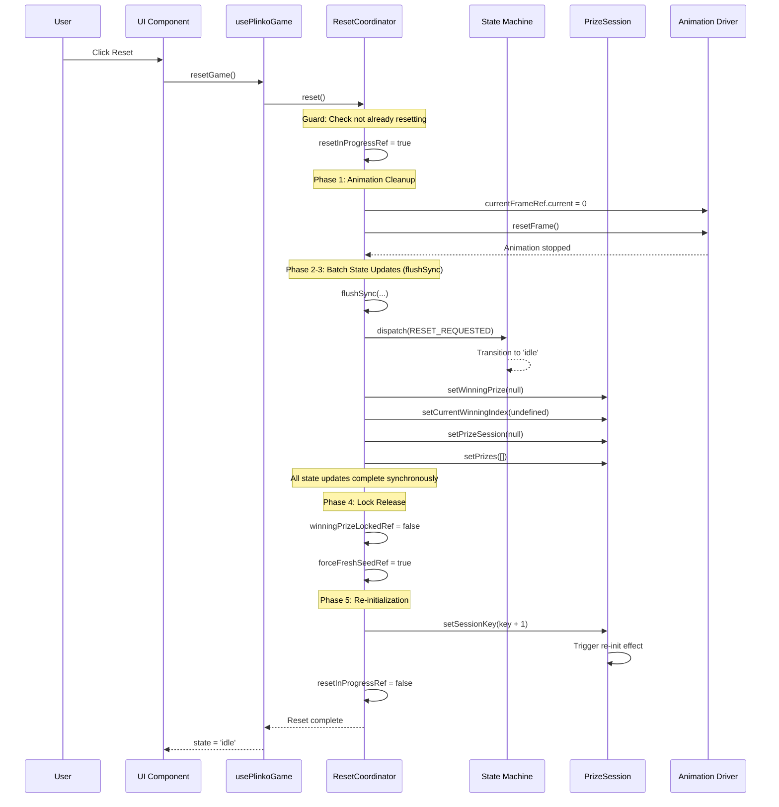
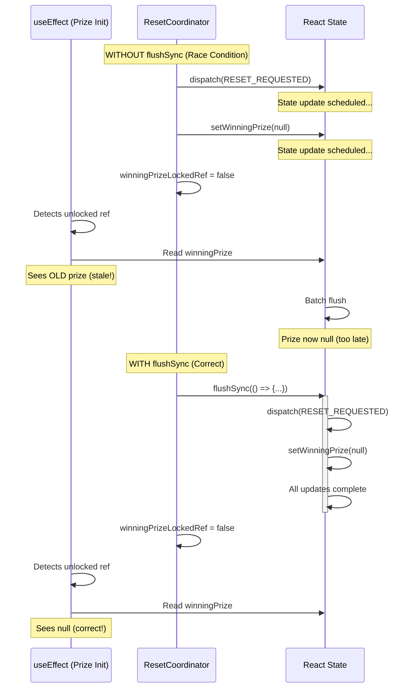

# Reset Orchestration

## Overview

The reset coordinator (`useResetCoordinator`) provides a centralized, ordered mechanism for resetting the Plinko game to its initial state. This document explains the reset flow, timing, dependencies, and implementation details.

**Why centralized reset?**
- Prevents partial resets (missing a cleanup step)
- Ensures correct ordering (dependencies between phases)
- Guards against concurrent resets
- Makes reset logic testable
- Provides reset telemetry for debugging

---

## Table of Contents

- [Reset Phases](#reset-phases)
- [Sequence Diagrams](#sequence-diagrams)
- [State Transitions](#state-transitions)
- [Timing & Dependencies](#timing--dependencies)
- [Implementation Details](#implementation-details)
- [Race Condition Prevention](#race-condition-prevention)
- [Testing Strategy](#testing-strategy)
- [Troubleshooting](#troubleshooting)

---

## Reset Phases

The reset coordinator executes 5 phases in strict sequential order:

### Phase 1: Animation Cleanup

**Purpose:** Stop all animations and reset frame counter

```typescript
// Stop animation loop
refs.currentFrameRef.current = 0;
resetFrame();
```

**What it cleans:**
- Animation frame counter
- RequestAnimationFrame loops
- Animation timers
- Ball animation driver state

**Why first?**
- Prevents animations from accessing soon-to-be-cleared state
- Ensures no RAF callbacks fire during reset
- Releases animation resources immediately

### Phase 2: State Machine Reset

**Purpose:** Return state machine to idle state

```typescript
dispatch({ type: 'RESET_REQUESTED' });
```

**State transition:**
- Any state → `idle`

**Side effects:**
- Clears trajectory
- Clears trajectory cache
- Resets game context

### Phase 3: Prize State Cleanup

**Purpose:** Clear all prize-related state

```typescript
setWinningPrize(null);
setCurrentWinningIndex(undefined);
setPrizeSession(null);
setPrizes([]);
```

**What it clears:**
- Winning prize reference
- Winning slot index
- Prize session data
- Prizes array (UI state)

**Why after state machine?**
- State machine transition must complete before clearing data
- Prevents state machine from accessing null prizes during transition

### Phase 4: Lock Release

**Purpose:** Release ref-based locks and set flags

```typescript
refs.winningPrizeLockedRef.current = false;
refs.forceFreshSeedRef.current = true;
```

**What it unlocks:**
- `winningPrizeLockedRef` - Allows new prize selection
- `forceFreshSeedRef` - Forces fresh seed (ignores URL overrides)

**Why after state cleanup?**
- Ensures no effect observes unlocked state with stale data
- Prevents race conditions in prize loading

### Phase 5: Re-initialization Trigger

**Purpose:** Trigger new session initialization

```typescript
setSessionKey((key) => key + 1);
```

**What it triggers:**
- `usePrizeSession` re-initialization
- Fresh prize loading
- New seed generation (if `forceFreshSeedRef` is true)

**Why last?**
- All cleanup must complete before starting new session
- Ensures clean slate for initialization effects

---

## Sequence Diagrams

### Full Reset Flow



### State Transitions During Reset

```mermaid
stateDiagram-v2
    [*] --> AnyState: Game in progress

    AnyState --> ResettingGuard: resetGame()
    ResettingGuard --> Phase1: Guard passes
    ResettingGuard --> AnyState: Already resetting (rejected)

    Phase1 --> Phase2: Animation cleanup done
    state Phase1 {
        [*] --> StopAnimations
        StopAnimations --> ResetFrame
        ResetFrame --> [*]
    }

    Phase2 --> Phase3: State machine reset
    state Phase2 {
        [*] --> DispatchReset
        DispatchReset --> StateMachineIdle
        StateMachineIdle --> [*]
    }

    Phase3 --> Phase4: Prize state cleared
    state Phase3 {
        [*] --> ClearWinningPrize
        ClearWinningPrize --> ClearIndex
        ClearIndex --> ClearSession
        ClearSession --> ClearPrizes
        ClearPrizes --> [*]
    }

    Phase4 --> Phase5: Locks released
    state Phase4 {
        [*] --> UnlockWinningPrize
        UnlockWinningPrize --> SetForceFreshSeed
        SetForceFreshSeed --> [*]
    }

    Phase5 --> Idle: Session key incremented
    state Phase5 {
        [*] --> IncrementSessionKey
        IncrementSessionKey --> TriggerReInit
        TriggerReInit --> [*]
    }

    Idle --> [*]: Ready for new game
```



### Race Condition Prevention



---

## State Transitions

### Valid Reset Entry States

Reset can be called from any state:

| Current State | After Reset | Notes |
|--------------|-------------|-------|
| `idle` | `idle` | No-op (already clean) |
| `ready` | `idle` | Clears loaded prizes |
| `countdown` | `idle` | Stops countdown timer |
| `dropping` | `idle` | Stops ball animation |
| `landed` | `idle` | Clears ball position |
| `celebrating` | `idle` | Stops celebration |
| `revealed` | `idle` | Closes prize reveal |
| `claimed` | `idle` | Clears claimed state |

### State Machine Transition

```typescript
// State machine handles RESET_REQUESTED event
{
  // Any state can transition to idle on reset
  [State]: {
    on: {
      RESET_REQUESTED: { target: 'idle' }
    }
  }
}
```

---

## Timing & Dependencies

### Critical Timing Requirements

1. **Animation must stop before state clears**
   - Otherwise: RAF callbacks access null state
   - Solution: Phase 1 runs first

2. **State machine must reset before prize cleanup**
   - Otherwise: State machine transition sees null prizes
   - Solution: Phase 2 before Phase 3

3. **Prize state must clear before unlocking**
   - Otherwise: Effects see unlocked + stale data
   - Solution: Phase 3 before Phase 4, use `flushSync`

4. **Locks must release before re-init**
   - Otherwise: New session can't select winner
   - Solution: Phase 4 before Phase 5

5. **All cleanup must finish before session key increments**
   - Otherwise: New session initializes with partial state
   - Solution: Phase 5 runs last

### Dependency Graph

```
Phase 1 (Animation)
    ↓
Phase 2 (State Machine) ───┐
    ↓                      │
Phase 3 (Prize State) ←────┘ (depends on machine being idle)
    ↓
Phase 4 (Lock Release)
    ↓
Phase 5 (Re-init Trigger)
```

---

## Implementation Details

### Using flushSync for Consistency

The coordinator uses `flushSync` to batch Phases 2-3 synchronously:

```typescript
import { flushSync } from 'react-dom';

// Batch state updates to prevent race conditions
flushSync(() => {
  dispatch({ type: 'RESET_REQUESTED' });
  setWinningPrize(null);
  setCurrentWinningIndex(undefined);
  setPrizeSession(null);
  setPrizes([]);
});

// At this point, ALL state updates are complete
// Safe to release locks
refs.winningPrizeLockedRef.current = false;
```

**Why flushSync?**

Without `flushSync`, React batches state updates asynchronously. This creates race conditions:

1. **State Machine Race:** State machine transitions to `idle` asynchronously, but prize initialization effect may run before state updates complete
2. **Prize Lock Race:** `winningPrizeLockedRef` is cleared while state updates are pending, allowing effects to see stale data
3. **Session Key Race:** New session key triggers re-init before previous state is fully cleared

**Performance Impact:**

- Minimal: Reset happens 1-2 times per game session (not during 60 FPS animation)
- Measured: <5ms total reset time
- Benefit: Eliminates race conditions that cause bugs

### Concurrency Guard

```typescript
const resetInProgressRef = useRef(false);

const reset = useCallback(() => {
  // Reject concurrent reset attempts
  if (resetInProgressRef.current) {
    console.warn('[ResetCoordinator] Reset already in progress');
    return;
  }

  resetInProgressRef.current = true;

  try {
    // Execute reset phases...
  } finally {
    resetInProgressRef.current = false;
  }
}, [refs, resetFrame, dispatch, setters]);
```

**Why guard?**

- User clicks reset multiple times quickly
- Programmatic reset called during transition
- Error during reset triggers another reset

**Effect:**

- Only one reset can execute at a time
- Subsequent calls are ignored until current reset completes
- Idempotent: safe to call reset multiple times

### Stable Parameters

```typescript
export function useResetCoordinator(
  refs: {
    currentFrameRef: ValueRef<number>;
    winningPrizeLockedRef: ValueRef<boolean>;
    forceFreshSeedRef: ValueRef<boolean>;
  },
  resetFrame: () => void,
  dispatch: React.Dispatch<GameEvent>,
  setters: {
    setWinningPrize: React.Dispatch<React.SetStateAction<PrizeConfig | null>>;
    // ... other setters
  }
): UseResetCoordinatorResult
```

**Why stable parameters?**

- Prevents unnecessary re-renders
- `dispatch` is stable (from `useReducer`)
- `setters` are stable (from `useState`)
- `resetFrame` must be wrapped in `useCallback`
- `refs` are stable (object references)

---

## Race Condition Prevention

### Race 1: State Machine vs Prize Loading

**Problem:**
```typescript
// Without flushSync
dispatch({ type: 'RESET_REQUESTED' }); // Scheduled
setWinningPrize(null);                 // Scheduled
// Effects may run here before flush!
refs.winningPrizeLockedRef.current = false;
// Prize loading effect sees unlocked + stale winning prize
```

**Solution:**
```typescript
// With flushSync - all updates complete synchronously
flushSync(() => {
  dispatch({ type: 'RESET_REQUESTED' });
  setWinningPrize(null);
});
refs.winningPrizeLockedRef.current = false;
// Prize loading effect now sees unlocked + null prize (correct)
```

### Race 2: Animation Frame vs State

**Problem:**
```typescript
// RAF callback fires
const point = trajectory.points[currentFrame]; // trajectory is null!
```

**Solution:**
```typescript
// Phase 1: Stop animations FIRST
currentFrameRef.current = 0;
resetFrame(); // Cancels all RAF loops
// Phase 2: Then clear state
dispatch({ type: 'RESET_REQUESTED' });
```

### Race 3: Session Key vs Cleanup

**Problem:**
```typescript
// Increment session key first
setSessionKey(key + 1);
// Re-init effect runs with stale data
setPrizeSession(null); // Too late!
```

**Solution:**
```typescript
// Clear all state first (Phases 1-4)
setPrizeSession(null);
setPrizes([]);
refs.forceFreshSeedRef.current = true;
// THEN increment session key (Phase 5)
setSessionKey(key + 1);
// Re-init effect sees clean state
```

---

## Testing Strategy

### Unit Tests

**Test reset phases:**
```typescript
describe('useResetCoordinator', () => {
  it('should execute phases in order', () => {
    const { result } = renderHook(() => useResetCoordinator(...));

    const executionOrder: string[] = [];

    // Mock callbacks track execution
    resetFrame.mockImplementation(() => executionOrder.push('resetFrame'));
    dispatch.mockImplementation(() => executionOrder.push('dispatch'));

    act(() => result.current.reset());

    expect(executionOrder).toEqual([
      'resetFrame',   // Phase 1
      'dispatch',     // Phase 2
      // ... etc
    ]);
  });
});
```

**Test concurrency guard:**
```typescript
it('should reject concurrent resets', () => {
  const { result } = renderHook(() => useResetCoordinator(...));

  act(() => {
    result.current.reset();
    result.current.reset(); // Second call ignored
  });

  expect(resetFrame).toHaveBeenCalledTimes(1);
});
```

**Test ref cleanup:**
```typescript
it('should reset all refs', () => {
  const refs = {
    currentFrameRef: { current: 42 },
    winningPrizeLockedRef: { current: true },
    forceFreshSeedRef: { current: false }
  };

  const { result } = renderHook(() => useResetCoordinator(refs, ...));

  act(() => result.current.reset());

  expect(refs.currentFrameRef.current).toBe(0);
  expect(refs.winningPrizeLockedRef.current).toBe(false);
  expect(refs.forceFreshSeedRef.current).toBe(true);
});
```

### Integration Tests

**Test full game reset:**
```typescript
it('should reset complete game flow', () => {
  const { result } = renderHook(() => usePlinkoGame());

  // Start and progress game
  act(() => result.current.startGame());
  act(() => result.current.completeCountdown());

  // Reset
  act(() => result.current.resetGame());

  // Verify clean state
  expect(result.current.state).toBe('idle');
  expect(result.current.selectedPrize).toBeNull();
  expect(result.current.trajectory).toBeUndefined();
});
```

---

## Troubleshooting

### Problem: Reset doesn't clear state

**Symptoms:**
- Old prize still visible after reset
- Ball animation continues after reset
- State stuck in non-idle state

**Diagnosis:**
```typescript
// Check if reset is being called
console.log('[Reset] Starting reset...');

// Check if guard is blocking
if (resetInProgressRef.current) {
  console.warn('[Reset] Blocked by guard');
}

// Check each phase
console.log('[Reset Phase 1] Animation cleanup');
console.log('[Reset Phase 2] State machine reset');
// ... etc
```

**Solutions:**
- Ensure `resetGame()` is called from UI
- Check concurrency guard isn't stuck
- Verify all setters are passed to coordinator
- Check `flushSync` is imported from `react-dom`

### Problem: Race condition during reset

**Symptoms:**
- Effects run with stale data
- Prize loads before cleanup completes
- Animation accesses null trajectory

**Diagnosis:**
```typescript
// Add logging to effects
useEffect(() => {
  console.log('[PrizeInit] Running, locked:', winningPrizeLockedRef.current);
  console.log('[PrizeInit] Winning prize:', winningPrize);
}, [winningPrizeLockedRef.current]);
```

**Solutions:**
- Ensure `flushSync` is used for Phases 2-3
- Check phase ordering (animation first, re-init last)
- Verify refs are cleared AFTER state updates

### Problem: Reset takes too long

**Symptoms:**
- Visible delay between reset click and idle state
- UI frozen during reset

**Diagnosis:**
```typescript
// Measure reset time
const start = performance.now();
resetCoordinator.reset();
const duration = performance.now() - start;
console.log('[Reset] Duration:', duration, 'ms');
```

**Solutions:**
- Profile which phase is slow
- Check for expensive cleanup operations
- Ensure no synchronous I/O during reset
- Consider async cleanup for non-critical resources

### Problem: State machine doesn't return to idle

**Symptoms:**
- Reset completes but state is not 'idle'
- Can't start new game

**Diagnosis:**
```typescript
// Check state machine transition
console.log('[Reset] Before:', state);
dispatch({ type: 'RESET_REQUESTED' });
console.log('[Reset] After:', state);
```

**Solutions:**
- Verify state machine has `RESET_REQUESTED` handler
- Check all states have transition to `idle`
- Ensure dispatch is from `useReducer` (stable reference)

---

## Related Documentation

- [ADR 005: Reset Coordinator Pattern](/docs/adr/005-reset-coordinator.md) - Design decisions
- [Architecture Guide](/docs/architecture.md) - System overview
- [State Machine Pattern](/docs/adr/003-state-machine-pattern.md) - State management
- [Game Orchestration](/docs/game-orchestration.md) - Hook composition

---

## Summary

The reset coordinator provides:

1. **Ordered execution** - 5 phases run sequentially
2. **Race condition prevention** - `flushSync` ensures consistency
3. **Concurrency guard** - Prevents overlapping resets
4. **Clean state guarantee** - All state cleared before re-init
5. **Testability** - Single contract to test

**Key Takeaways:**

- Always use `resetCoordinator.reset()`, never manual cleanup
- Phases must run in order (dependencies between phases)
- `flushSync` is critical for preventing race conditions
- Reset is idempotent (safe to call multiple times)
- Performance impact is minimal (<5ms per reset)
