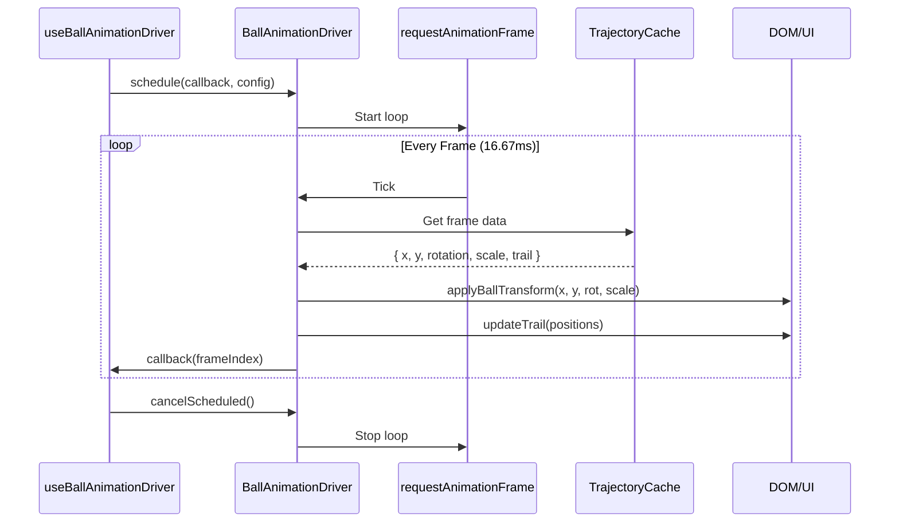

# Animation Pipeline Architecture

## Overview

The animation pipeline provides a two-tier architecture for smooth, cross-platform motion:

1. **Animation Driver** (`src/theme/animationDrivers/`) - Declarative animations for UI components (mount/unmount, interactions, layout transitions)
2. **Ball Animation Driver** (`src/animation/`) - High-frequency 60 FPS imperative loop for game physics playback

This separation ensures UI animations can be declarative and React-friendly while ball physics bypass React reconciliation for maximum performance.

**Key Goals:**
- Single API across web (Framer Motion) and React Native (Moti/Reanimated)
- GPU-safe animations (transforms, opacity, colors only)
- Deterministic playback synchronized with precomputed trajectory cache
- Lazy platform-specific loading

---

## Table of Contents

- [Animation Driver (Declarative)](#animation-driver-declarative)
  - [Architecture](#architecture)
  - [API Reference](#api-reference)
  - [Usage Patterns](#usage-patterns)
  - [Platform Implementations](#platform-implementations)
- [Ball Animation Driver (Imperative)](#ball-animation-driver-imperative)
  - [Architecture](#architecture-1)
  - [Frame Loop Flow](#frame-loop-flow)
  - [API Reference](#api-reference-1)
  - [Integration with Trajectory Cache](#integration-with-trajectory-cache)
- [createAnimatedComponent Pattern](#createanimatedcomponent-pattern)
- [Cross-Platform Constraints](#cross-platform-constraints)
- [Testing & QA](#testing--qa)
- [Migration Guide](#migration-guide)

---

## Animation Driver (Declarative)

### Architecture

The animation driver abstraction lives in `src/theme/animationDrivers/`:

```
src/theme/animationDrivers/
├── index.ts                 # Barrel exports
├── types.ts                 # AnimationDriver interface, configs, presets
├── framer.ts               # Web implementation (Framer Motion)
├── moti.tsx                # React Native implementation (Moti)
├── useAnimationDriver.ts   # Platform selection hook
└── useAnimation.ts         # Shared animation utilities
```

**Core Interface (`AnimationDriver`):**
```typescript
interface AnimationDriver {
  name: 'framer' | 'moti';
  platform: 'web' | 'native';

  // Create animated component wrapper
  createAnimatedComponent<T>(component: T): AnimatedComponent<T>;

  // Mount/unmount choreography
  AnimatePresence: ComponentType<AnimatePresenceProps>;

  // Environment checks
  isSupported(): boolean;
  prefersReducedMotion(): boolean;

  // Optimized presets
  getSpringConfig(preset: 'gentle' | 'wobbly' | 'stiff' | 'slow'): SpringConfig;
  getTransitionConfig(preset: 'fast' | 'medium' | 'slow' | 'spring'): TransitionConfig;
}
```

### API Reference

#### `useAnimationDriver()`

Hook for accessing the current platform's animation driver:

```tsx
import { useAnimationDriver } from '@/theme/animationDrivers';

function MyComponent() {
  const driver = useAnimationDriver();
  const AnimatedDiv = driver.createAnimatedComponent('div');

  return (
    <AnimatedDiv
      initial={{ opacity: 0, y: 20 }}
      animate={{ opacity: 1, y: 0 }}
      transition={driver.getTransitionConfig('medium')}
    >
      Content
    </AnimatedDiv>
  );
}
```

#### `getAnimationDriver()`

Non-React context access (tests, utilities):

```typescript
import { getAnimationDriver } from '@/theme/animationDrivers';

const driver = getAnimationDriver('auto'); // or 'framer' | 'moti'
const config = driver.getSpringConfig('gentle');
```

#### Preset Configurations

**Spring Presets:**
```typescript
{
  gentle:  { stiffness: 120, damping: 14, mass: 0.8 },
  wobbly:  { stiffness: 180, damping: 12, mass: 1 },
  stiff:   { stiffness: 300, damping: 20, mass: 0.6 },
  slow:    { stiffness: 80,  damping: 20, mass: 1.2 }
}
```

**Transition Presets:**
```typescript
{
  fast:   { duration: 0.2, ease: [0.4, 0, 0.2, 1] },
  medium: { duration: 0.4, ease: [0.22, 1, 0.36, 1] },
  slow:   { duration: 0.6, ease: [0.22, 1, 0.36, 1] },
  spring: { type: 'spring', spring: SPRING_PRESETS.gentle }
}
```

### Usage Patterns

#### Basic Component Animation

```tsx
function FadeInPanel({ children }: PropsWithChildren) {
  const driver = useAnimationDriver();
  const AnimatedDiv = driver.createAnimatedComponent('div');

  return (
    <AnimatedDiv
      initial={{ opacity: 0, y: 16 }}
      animate={{ opacity: 1, y: 0 }}
      exit={{ opacity: 0, y: 8 }}
      transition={driver.getTransitionConfig('medium')}
    >
      {children}
    </AnimatedDiv>
  );
}
```

#### Mount/Unmount Choreography

```tsx
function ScreenTransition({ screen }: { screen: 'start' | 'game' | 'reveal' }) {
  const driver = useAnimationDriver();
  const { AnimatePresence } = driver;

  return (
    <AnimatePresence mode="wait">
      {screen === 'start' && <StartScreen key="start" />}
      {screen === 'game' && <GameBoard key="game" />}
      {screen === 'reveal' && <PrizeReveal key="reveal" />}
    </AnimatePresence>
  );
}
```

#### Staggered Children

```tsx
function PrizeList({ prizes }: { prizes: Prize[] }) {
  const driver = useAnimationDriver();
  const AnimatedDiv = driver.createAnimatedComponent('div');

  return (
    <AnimatedDiv
      initial="hidden"
      animate="visible"
      variants={{
        hidden: { opacity: 0 },
        visible: {
          opacity: 1,
          transition: { staggerChildren: 0.1 }
        }
      }}
    >
      {prizes.map(prize => (
        <AnimatedDiv
          key={prize.id}
          variants={{
            hidden: { opacity: 0, y: 20 },
            visible: { opacity: 1, y: 0 }
          }}
        >
          {prize.name}
        </AnimatedDiv>
      ))}
    </AnimatedDiv>
  );
}
```

#### Reduced Motion Support

```tsx
function AccessibleAnimation({ children }: PropsWithChildren) {
  const driver = useAnimationDriver();
  const AnimatedDiv = driver.createAnimatedComponent('div');
  const prefersReduced = driver.prefersReducedMotion();

  if (prefersReduced) {
    return <div>{children}</div>;
  }

  return (
    <AnimatedDiv
      initial={{ opacity: 0 }}
      animate={{ opacity: 1 }}
      transition={driver.getTransitionConfig('fast')}
    >
      {children}
    </AnimatedDiv>
  );
}
```

### Platform Implementations

#### Web - Framer Motion (`framer.ts`)

```typescript
class FramerMotionDriver implements AnimationDriver {
  name = 'framer' as const;
  platform = 'web' as const;

  createAnimatedComponent<T>(component: T) {
    return motion[component as keyof typeof motion];
  }

  AnimatePresence = AnimatePresence;

  isSupported(): boolean {
    return typeof window !== 'undefined' && !this.environment.isSSR;
  }

  prefersReducedMotion(): boolean {
    return window.matchMedia('(prefers-reduced-motion: reduce)').matches;
  }
}
```

**Features:**
- Wraps `motion.*` components from Framer Motion
- Detects SSR and reduced motion via `matchMedia`
- Provides spring/tween presets tuned for 60 FPS

#### React Native - Moti (`moti.tsx`)

```tsx
class MotiDriver implements AnimationDriver {
  name = 'moti' as const;
  platform = 'native' as const;

  createAnimatedComponent<T>(component: T) {
    // Maps to MotiView, MotiText, etc.
    return MotiView; // Component-specific mapping
  }

  AnimatePresence = MotiAnimatePresence;

  isSupported(): boolean {
    return !AccessibilityInfo.isReduceMotionEnabled;
  }
}
```

**Migration Checklist:**
1. Install `moti` and `react-native-reanimated`
2. Replace placeholders with `MotiView`, `MotiText` components
3. Mirror spring/tween presets to match web timings
4. Use `react-native-linear-gradient` for gradient animations

---

## Ball Animation Driver (Imperative)

### Architecture

High-frequency physics playback lives in `src/animation/`:

```
src/animation/
├── index.ts                      # Barrel exports
├── ballAnimationDriver.ts        # Shared contract (interface)
├── ballAnimationDriver.web.ts    # Web RAF implementation
├── ballAnimationDriver.native.ts # React Native Reanimated (planned)
├── useBallAnimationDriver.ts     # Hook to access driver
├── pegRippleUtils.ts            # Peg highlight coordination
└── trailOptimization.ts         # Trail pooling and caching
```

**Core Contract:**
```typescript
interface BallAnimationDriver {
  // Frame scheduling
  schedule(callback: FrameCallback, config: AnimationTimingConfig): void;
  cancelScheduled(): void;

  // Ball transforms (GPU-accelerated)
  applyBallTransform(x: number, y: number, rotation: number, scale: number): void;

  // Trail rendering (pooled elements)
  updateTrail(positions: TrailPosition[]): void;
  clearTrail(): void;

  // Peg/slot feedback
  flashPeg(pegIndex: number, duration: number): void;
  clearAllPegFlashes(): void;
  highlightSlot(slotIndex: number): void;
  clearAllSlotHighlights(): void;

  // Cleanup
  cleanup(): void;
}
```

### Frame Loop Flow



### API Reference

#### `useBallAnimationDriver()`

Hook for accessing the ball animation driver:

```tsx
import { useBallAnimationDriver } from '@/animation/useBallAnimationDriver';

function GameBoard({ trajectory }: { trajectory: Trajectory }) {
  const driver = useBallAnimationDriver();

  useEffect(() => {
    driver.schedule(
      (frameIndex) => {
        const point = trajectory.points[frameIndex];
        driver.applyBallTransform(point.x, point.y, point.rotation, point.scale);
      },
      { duration: 2000, fps: 60 }
    );

    return () => driver.cancelScheduled();
  }, [trajectory]);
}
```

#### Web Implementation (`ballAnimationDriver.web.ts`)

**Key Features:**
- Single `requestAnimationFrame` loop per game instance
- Pooled trail elements (fixed size, recycled)
- Direct DOM manipulation (bypasses React reconciliation)
- Data attributes for peg/slot highlighting

**Performance Optimizations:**
```typescript
// Pre-allocated trail pool
const trailPool: HTMLElement[] = Array(MAX_TRAIL_LENGTH)
  .fill(null)
  .map(() => createTrailElement());

// Direct transform updates (GPU-accelerated)
function applyBallTransform(x: number, y: number, rotation: number, scale: number) {
  ballElement.style.transform =
    `translate(${x}px, ${y}px) rotate(${rotation}deg) scale(${scale})`;
}

// Reuse pool elements
function updateTrail(positions: TrailPosition[]) {
  positions.forEach((pos, i) => {
    const element = trailPool[i];
    element.style.transform = `translate(${pos.x}px, ${pos.y}px)`;
    element.style.opacity = `${pos.opacity}`;
  });
}
```

#### React Native Migration (`ballAnimationDriver.native.ts`)

**Implementation Strategy:**
```typescript
// Use Reanimated shared values
const ballX = useSharedValue(0);
const ballY = useSharedValue(0);
const ballRotation = useSharedValue(0);
const ballScale = useSharedValue(1);

// Worklet for UI thread updates
const updateBallWorklet = () => {
  'worklet';
  ballX.value = trajectoryCache[frameIndex].x;
  ballY.value = trajectoryCache[frameIndex].y;
  ballRotation.value = trajectoryCache[frameIndex].rotation;
  ballScale.value = trajectoryCache[frameIndex].scale;
};

// Animated style
const ballAnimatedStyle = useAnimatedStyle(() => ({
  transform: [
    { translateX: ballX.value },
    { translateY: ballY.value },
    { rotate: `${ballRotation.value}deg` },
    { scale: ballScale.value }
  ]
}));
```

### Integration with Trajectory Cache

The ball animation driver consumes precomputed trajectory data:

```typescript
// Trajectory cache provides per-frame data
interface TrajectoryCache {
  frames: Array<{
    x: number;
    y: number;
    vx: number;
    vy: number;
    rotation: number;
    scale: { x: number; y: number };
  }>;
  trailPositions: Array<TrailPosition[]>;
  pegFlashes: Array<{ pegIndex: number; timestamp: number }>;
}

// Driver consumes cache without recalculation
driver.schedule((frameIndex) => {
  const frame = trajectoryCache.frames[frameIndex];
  driver.applyBallTransform(frame.x, frame.y, frame.rotation, frame.scale.x);
  driver.updateTrail(trajectoryCache.trailPositions[frameIndex]);

  const flash = trajectoryCache.pegFlashes[frameIndex];
  if (flash) {
    driver.flashPeg(flash.pegIndex, 300);
  }
}, { duration: trajectory.duration, fps: 60 });
```

---

## createAnimatedComponent Pattern

The `createAnimatedComponent` method provides platform-specific animated primitives:

### Type-Safe Usage

```tsx
// Inferred component props + animation props
const driver = useAnimationDriver();
const AnimatedDiv = driver.createAnimatedComponent('div');

<AnimatedDiv
  // Standard div props
  className="ball"
  onClick={handleClick}

  // Animation props
  initial={{ opacity: 0 }}
  animate={{ opacity: 1 }}
  transition={driver.getTransitionConfig('fast')}
>
  Content
</AnimatedDiv>
```

### Platform Mapping

| Component | Web (Framer) | React Native (Moti) |
|-----------|-------------|---------------------|
| `'div'` | `motion.div` | `MotiView` |
| `'span'` | `motion.span` | `MotiText` |
| `'button'` | `motion.button` | `MotiPressable` |
| Custom component | `motion(Component)` | `motify(Component)` |

### Custom Component Wrapping

```tsx
// Wrap custom components
const AnimatedCard = driver.createAnimatedComponent(Card);

<AnimatedCard
  // Card props
  title="Prize"
  image={prizeImage}

  // Animation props
  whileHover={{ scale: 1.05 }}
  whileTap={{ scale: 0.95 }}
/>
```

---

## Cross-Platform Constraints

### Allowed Animations

✅ **GPU-Friendly (Cross-Platform Safe):**
- `translateX`, `translateY`, `translateZ`
- `scale`, `scaleX`, `scaleY`
- `rotate`, `rotateX`, `rotateY`, `rotateZ`
- `opacity`
- `backgroundColor`, `color`
- Linear gradients (via `react-native-linear-gradient`)

### Forbidden Features

❌ **Web-Only (Breaks React Native):**
- `blur`, `filter`, `backdrop-filter`
- `box-shadow`, `text-shadow`
- Radial/conic gradients
- CSS pseudo-elements (`:before`, `:after`)
- `clip-path`, `mask`

### Migration Strategy

When porting animations to React Native:

1. **Audit Animation Properties:**
   - Check all `initial`, `animate`, `exit` configs
   - Verify no forbidden CSS properties

2. **Replace Gradients:**
   ```tsx
   // Web
   background: 'radial-gradient(...)' // ❌ Not supported

   // Cross-platform
   background: 'linear-gradient(...)' // ✅ Works everywhere
   ```

3. **Use Animation Tokens:**
   ```tsx
   // Centralized in src/theme/animationDrivers/types.ts
   const config: AnimationConfig = {
     x: 100,        // ✅ Cross-platform
     y: 50,         // ✅ Cross-platform
     scale: 1.2,    // ✅ Cross-platform
     opacity: 0.8   // ✅ Cross-platform
   };
   ```

---

## Testing & QA

### Manual Testing Checklist

**Animation Driver:**
- [ ] All animations run at 60 FPS (DevTools timeline)
- [ ] AnimatePresence transitions are smooth
- [ ] Reduced motion preference disables animations
- [ ] SSR doesn't crash (server-side rendering)

**Ball Animation Driver:**
- [ ] Ball follows trajectory precisely
- [ ] Trail elements pool correctly (no leaks)
- [ ] Peg flashes synchronize with collisions
- [ ] Slot highlights appear at landing
- [ ] Reset clears all visual state

### Unit Tests

```typescript
// src/tests/unit/animation/ballAnimationDriver.test.ts
describe('BallAnimationDriver', () => {
  it('should schedule frame updates', () => {
    const driver = createBallAnimationDriver();
    const callback = vi.fn();

    driver.schedule(callback, { duration: 1000, fps: 60 });

    vi.advanceTimersByTime(16.67);
    expect(callback).toHaveBeenCalledWith(0);
  });

  it('should apply ball transforms', () => {
    const driver = createBallAnimationDriver();
    driver.applyBallTransform(100, 200, 45, 1.2);

    expect(ballElement.style.transform).toBe(
      'translate(100px, 200px) rotate(45deg) scale(1.2)'
    );
  });
});
```

### Integration Tests (Playwright)

```typescript
// scripts/playwright/ball-animation.spec.ts
test('ball animation follows trajectory', async ({ page }) => {
  await page.goto('/');
  await page.click('[data-testid="start-game"]');

  // Track ball position over time
  const positions = [];
  for (let i = 0; i < 10; i++) {
    const ball = page.locator('[data-testid="ball"]');
    const box = await ball.boundingBox();
    positions.push({ x: box.x, y: box.y });
    await page.waitForTimeout(100);
  }

  // Verify ball moved downward
  expect(positions[9].y).toBeGreaterThan(positions[0].y);
});
```

---

## Migration Guide

### From Inline Framer Motion to Animation Driver

**Before:**
```tsx
import { motion } from 'framer-motion';

function Component() {
  return (
    <motion.div
      initial={{ opacity: 0 }}
      animate={{ opacity: 1 }}
      transition={{ duration: 0.3 }}
    >
      Content
    </motion.div>
  );
}
```

**After:**
```tsx
import { useAnimationDriver } from '@/theme/animationDrivers';

function Component() {
  const driver = useAnimationDriver();
  const AnimatedDiv = driver.createAnimatedComponent('div');

  return (
    <AnimatedDiv
      initial={{ opacity: 0 }}
      animate={{ opacity: 1 }}
      transition={driver.getTransitionConfig('medium')}
    >
      Content
    </AnimatedDiv>
  );
}
```

**Benefits:**
- Platform-agnostic (works with Moti on React Native)
- Centralized timing presets
- Easier to test (mock driver)

### From Manual RAF to Ball Animation Driver

**Before:**
```tsx
useEffect(() => {
  let animationId: number;

  const animate = () => {
    const point = trajectory.points[frameIndex];
    ballElement.style.transform = `translate(${point.x}px, ${point.y}px)`;
    animationId = requestAnimationFrame(animate);
  };

  animationId = requestAnimationFrame(animate);

  return () => cancelAnimationFrame(animationId);
}, [trajectory]);
```

**After:**
```tsx
const driver = useBallAnimationDriver();

useEffect(() => {
  driver.schedule(
    (frameIndex) => {
      const point = trajectory.points[frameIndex];
      driver.applyBallTransform(point.x, point.y, 0, 1);
    },
    { duration: trajectory.duration, fps: 60 }
  );

  return () => driver.cancelScheduled();
}, [trajectory]);
```

**Benefits:**
- Automatic frame timing
- Trail pooling included
- Easier to migrate to React Native
- Better performance (pre-allocated pools)

---

## Related Documentation

- [Animation Driver ADR](/docs/adr/009-ball-animation-driver.md) - Design decisions
- [Theme System](/docs/theming.md) - Token integration
- [Cross-Platform Architecture](/docs/adr/001-cross-platform-architecture.md) - Platform strategy
- [Performance Optimization](/docs/power-saving-mode.md) - Frame rate management
